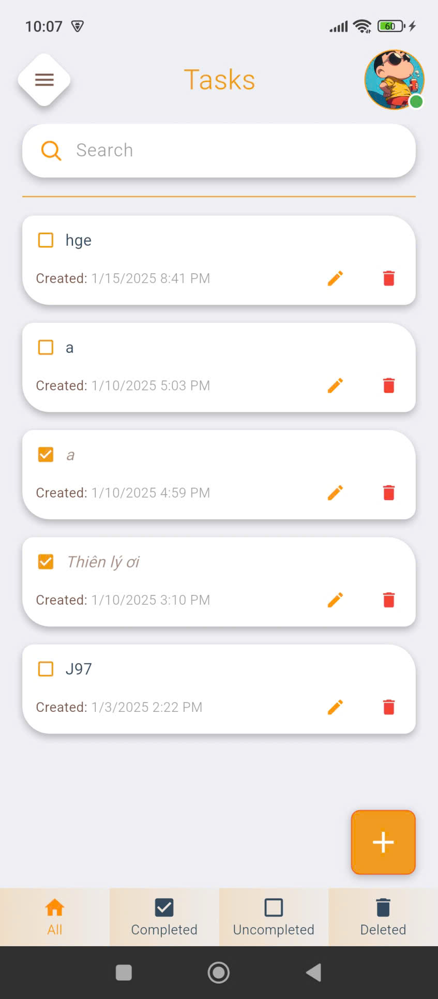
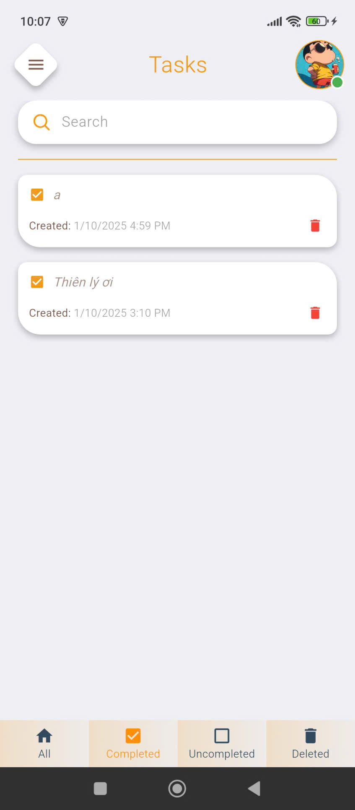
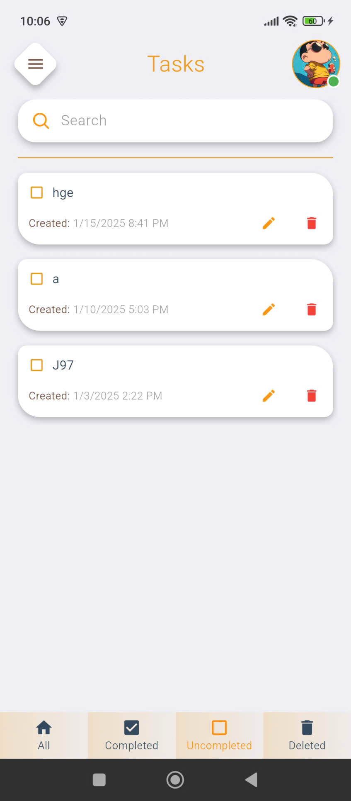
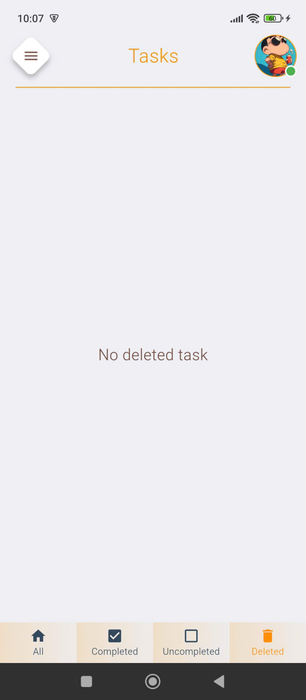
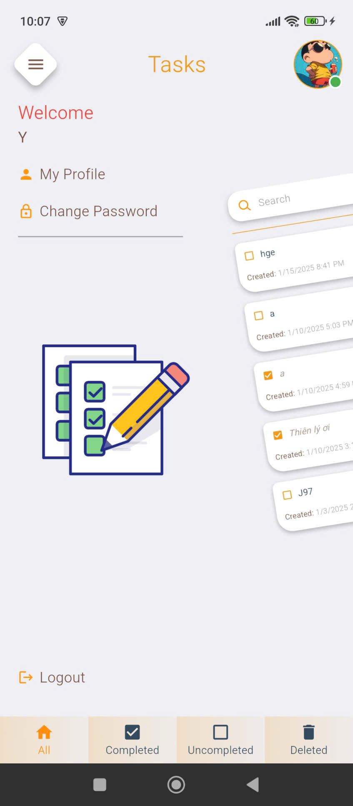

# 📱 TodoList App

A modern, feature-rich Flutter application for managing tasks efficiently with beautifully designed UI and smooth user experience.

## ✨ Features

### 🔐 Authentication
- User registration with email verification
- Secure login with OTP validation
- Password reset functionality
- Session management with JWT tokens

### 📝 Task Management
- **Create** new tasks easily
- **Read** tasks with search functionality
- **Update** task status (Complete/Incomplete)
- **Delete** tasks with confirmation dialog
- **Filter** tasks by status:
  - All Tasks
  - Completed Tasks
  - Uncompleted Tasks
  - Deleted Tasks

### 👤 User Profile
- View detailed user profile information
- Edit full name and profile picture
- Change password securely
- Logout functionality

### 🎨 UI/UX
- Modern Material Design
- Smooth animations and transitions
- Responsive layout for different screen sizes
- Intuitive navigation with bottom tab bar
- Drawer menu for easy access
- Search functionality with debounce
- Task cards with swipe actions

## 🛠 Tech Stack

- **Framework:** Flutter 3.8+
- **Language:** Dart
- **State Management:** setState (can be upgraded to Provider/Riverpod)
- **HTTP:** http package with pretty_http_logger
- **Local Storage:** shared_preferences
- **UI Components:**
  - flutter_zoom_drawer (Drawer navigation)
  - flutter_slidable (Swipe actions)
  - pin_code_fields (OTP input)
  - shimmer (Loading animations)
  - flutter_svg (Vector graphics)
  - flutter_gen (Asset generation)

## 📸 Screenshots

### 🎯 Onboarding Flow
<div align="center">
<table>
<tr>
<td width="33%">
<br/>
<b>Onboarding 1</b><br/>
Welcome & Introduction
</td>
<td width="33%">
<br/>
<b>Onboarding 2</b><br/>
Features Overview
</td>
<td width="33%">
<br/>
<b>Onboarding 3</b><br/>
Get Started
</td>
</tr>
</table>
</div>

### Authentication Flow
<div align="center">
<table>
<tr>
<td width="33%">
<br/>
<b>Login Page</b><br/>
Sign in with email & password
</td>
<td width="33%">
<br/>
<b>Register Page</b><br/>
Create account with email verification
</td>
<td width="33%">
<br/>
<b>Forgot Password</b><br/>
Password reset with OTP
</td>
</tr>
</table>
</div>

### Main Task Management
<div align="center">
<table>
<tr>
<td width="25%">
<br/>
<b>All Tasks</b><br/>
View all tasks, search & filter
</td>
<td width="25%">
<br/>
<b>Completed Tasks</b><br/>
Manage completed items
</td>
<td width="25%">
<br/>
<b>Uncompleted Tasks</b><br/>
Track pending tasks
</td>
<td width="25%">
<br/>
<b>Deleted Tasks</b><br/>
Manage trash & restore
</td>
</tr>
</table>
</div>

### User Profile & Navigation
<div align="center">
<table>
<tr>
<td width="50%">
<br/>
<b>Drawer Menu</b><br/>
Quick access to all features
</td>
<td width="50%">
<br/>
<b>Home Screen</b><br/>
Main task dashboard
</td>
</tr>
</table>
</div>

## 🚀 Getting Started

### Prerequisites
- Flutter SDK 3.8 or higher
- Dart SDK (comes with Flutter)
- Android Studio or Xcode (for mobile development)
- Git

### Installation

1. **Clone the repository**
   ```bash
   git clone https://github.com/HoTrungY/task_todolist.git
   cd task_todolist
   ```

2. **Install dependencies**
   ```bash
   flutter pub get
   ```

3. **Run the app**
   ```bash
   flutter run
   ```

4. **Build APK (Android)**
   ```bash
   flutter build apk --release
   ```

5. **Build IPA (iOS)**
   ```bash
   flutter build ios --release
   ```

## 📁 Project Structure

```
lib/
├── main.dart                 # App entry point
├── components/              # Reusable UI components
│   ├── button/             # Custom buttons
│   ├── snack_bar/          # Toast notifications
│   ├── text_field/         # Input fields
│   └── ...                 # Other components
├── pages/                  # App screens
│   ├── auth/              # Authentication screens
│   ├── main/              # Main task screens
│   ├── profile/           # Profile screen
│   ├── onboarding/        # Onboarding screen
│   └── splash/            # Splash screen
├── models/                # Data models
├── services/              # API & local services
│   ├── remote/           # REST API calls
│   └── local/            # Local storage
├── utils/                 # Utilities & helpers
├── constants/             # App constants
├── resources/             # Colors, styles
└── gen/                   # Generated files
```

## 🔄 API Integration

The app uses RESTful API for:
- User authentication (register, login, reset password)
- Task CRUD operations
- Profile management
- Image upload

**Base API URL:** Configure in `lib/constants/app_constant.dart`

## 🎯 Key Classes

### AuthServices
- `sendOtp()` - Send OTP to email
- `register()` - User registration
- `login()` - User authentication
- `postForgotPassword()` - Password reset

### TaskServices
- `getListTask()` - Fetch tasks
- `createTask()` - Create new task
- `updateTask()` - Update task
- `deleteTask()` - Delete task

### AccountServices
- `getProfile()` - Fetch user profile
- `updateProfile()` - Update profile information

## 📦 Dependencies

```yaml
dependencies:
  flutter: sdk: flutter
  cupertino_icons: ^1.0.8
  http: ^1.2.1
  shared_preferences: ^2.2.3
  flutter_zoom_drawer: ^3.2.0
  flutter_slidable: ^4.0.0
  pin_code_fields: ^9.1.0
  flutter_gen_runner: ^5.5.0+1
  flutter_svg: ^2.0.10+1
  shimmer: ^3.0.0
  pretty_http_logger: ^1.0.3
  intl: ^0.20.2
  file_picker: ^10.2.0

dev_dependencies:
  flutter_test: sdk: flutter
  flutter_lints: ^6.0.0
  build_runner: ^2.4.10
  flutter_launcher_icons: ^0.14.4
```

## 🔒 Security Features

- JWT token-based authentication
- Secure password storage
- OTP verification for account actions
- SSL/TLS for API communication
- Local data encryption with shared_preferences

## 🧪 Testing

Run tests with:
```bash
flutter test
```

## 📝 Code Quality

- Follow Flutter/Dart style guide
- Run analyzer:
  ```bash
  dart analyze
  ```
- Format code:
  ```bash
  dart format .
  ```

## 🐛 Known Issues & Roadmap

### Current Version: 1.0.0
- ✅ Basic CRUD operations
- ✅ Authentication system
- ✅ Profile management
- ✅ Task filtering and search

### Future Enhancements
- [ ] Task categories/labels
- [ ] Due date reminders & notifications
- [ ] Recurring tasks
- [ ] Task priorities
- [ ] Dark theme support
- [ ] Offline synchronization
- [ ] Real-time collaboration
- [ ] Export tasks (PDF, CSV)
- [ ] Biometric authentication
- [ ] Cloud backup

## 🤝 Contributing

Contributions are welcome! Please:
1. Fork the repository
2. Create a feature branch (`git checkout -b feature/amazing-feature`)
3. Commit changes (`git commit -m 'Add amazing feature'`)
4. Push to branch (`git push origin feature/amazing-feature`)
5. Open a Pull Request

## 📄 License

This project is licensed under the MIT License - see the LICENSE file for details.

## 👨‍💻 Author

**Ho Trung Y**
- 📧 Email: hotrungY2242004@gmail.com
- 🐙 GitHub: [@HoTrungY](https://github.com/HoTrungY)

## 📞 Support

If you encounter any issues or have suggestions, please:
- Open an [Issue](https://github.com/HoTrungY/task_todolist/issues)
- Send an email to hotrungY2242004@gmail.com
- Create a discussion in the repository

## 🙏 Acknowledgments

- Thanks to the Flutter community for excellent packages
- Inspired by modern productivity apps
- Special thanks to all contributors

---

**Made with ❤️ by Ho Trung Y**

⭐ If you found this project helpful, please consider giving it a star!
